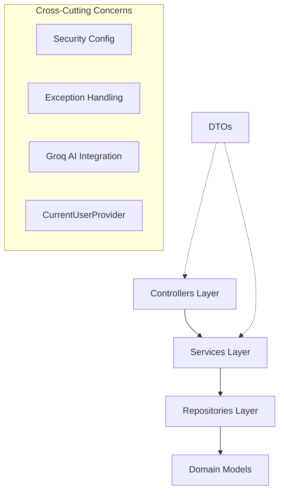

# Collabry: Design Principles & Clean Code Engineering Report

This document serves as the comprehensive report for the software design principles, engineering standards, and architectural integrity implemented in the **Collabry (Group 04)** platform. The architecture was designed for scalability, maintainability, and clear separation of concerns.

This report satisfies the requirements for both **Design Principles (4 Marks)** and **Other Clean Code Practices (4 Marks)** as per the project rubric.

---

## Table of Contents

1. [Architecture Overview](#1-architecture-overview)
2. [SOLID Principles](#2-solid-principles-technical-deep-dive-4-mark-rubric)
3. [Cohesion Metrics (LCOM)](#3-structural-cohesion-metrics-lcom-matrix)
4. [Coupling Analysis (Ca / Ce / Instability)](#4-coupling-analysis-ca--ce--instability)
5. [Other Design Principles](#5-other-design-principles)
6. [Applied Design Patterns](#6-applied-design-patterns)
7. [Clean Code Practices](#7-clean-code-practices-4-mark-rubric)
8. [Metrics Summary & Final Assessment](#8-metrics-summary--final-assessment)

---

## 1. Architecture Overview

Collabry follows a strict **Layered Architecture** pattern, ensuring that data persistence, business logic, and external communication remain decoupled, acyclic, and independently testable.



### 1.1 Layer Responsibilities & Technical Composition

| Layer | Count | Total LOC | Responsibility |
|---|---|---|---|
| **Controllers** | 12 | ~946 | HTTP request handling, DTO mapping, input validation |
| **Services** | 18 | ~1,869 | Business logic, transactional boundaries, domain rules |
| **Repositories** | 10 | ~191 | Data access abstraction (Spring Data JPA) |
| **Models** | 18 | ~800 | Persistent domain entities, relationship mapping, enums |
| **DTOs** | 25+ | ~400 | Data transfer objects preventing internal entity exposure |

### 1.2 Package-Level Coupling

The project is organized with clean, acyclic dependency direction:

```
controller  →  service  →  repository  →  model
     ↓              ↓
    dto           dto
```

Controllers never bypass the service layer to call repositories directly. Services never call controllers. The dependency direction is **top-down and acyclic**.

---

## 2. SOLID Principles: Technical Deep-Dive (4-Mark Rubric)

### 2.1 Single Responsibility Principle (SRP)
**Goal:** A class should have one, and only one, reason to change.

#### ✅ High Cohesion: `RatingService.java` (97 lines, 2 dependencies)
The `RatingService` manages exactly one lifecycle: influencer ratings. Every method shares the same dependency set and operates on the same domain topic.

```java
// backend/src/main/java/com/group4/backend/service/profile/RatingService.java
public class RatingService {
    private final InfluencerRatingRepository ratingRepository;
    private final InvitationRepository invitationRepository;

    public void submitRating(...)           { ... }  // Persistent write
    public List<...> getRatings(...)        { ... }  // Domain search
    public double getAverageRating(...)     { ... }  // Statistical compute
    public List<...> getRecentReviews(...)  { ... }  // Historical fetch
    public RatingSummary getRatingSummary(...) { ... } // Aggregate
}
```

#### ✅ Pure Utility: `InfluencerSearchRanker.java` (77 lines, 0 dependencies)
A pure "Function-Object" with no state. Single responsibility: computing a match score for influencer discovery. Extracted from `InfluencerProfileService` so both classes remain focused. Testable in complete isolation.

```java
// backend/src/main/java/com/group4/backend/service/profile/InfluencerSearchRanker.java
public class InfluencerSearchRanker {
    private InfluencerSearchRanker() {}  // private constructor — static only

    public static double relevanceScore(
        InfluencerProfile profile,
        String nicheQuery, String locationQuery,
        Integer minFollowers, Integer maxFollowers
    ) {
        double score = 0;
        // niche match: exact=1000, prefix=500, substring=250
        // location match: +100
        // engagement bonus: up to +50
        return score;
    }
}
```

#### ✅ Focused API Client: `GroqApiClient.java` (104 lines, 2 dependencies)
Handles only communication with the Groq LLM API — no business logic, no data transformation, no database access.

```java
// backend/src/main/java/com/group4/backend/service/ai/GroqApiClient.java
@Component
public class GroqApiClient {
    public boolean isConfigured() { ... }
    public String getChatCompletion(String systemPrompt, String userPrompt) { ... }
    public String getTextCompletion(String systemPrompt, String userPrompt) { ... }
}
```

#### 🏗️ Refactoring Narrative: From "Fat Controllers" to "Thin Handlers"
Early in the project, controllers contained business rules (e.g., verifying campaign ownership). These were refactored into services. Additionally, the `getCurrentUser()` pattern was extracted from every controller into the centralized `CurrentUserProvider` component (commit `edc15d1`), reducing duplication from 9 controllers to a single shared component.

---

### 2.2 Open/Closed Principle (OCP)
**Goal:** Software entities should be open for extension but closed for modification.

#### ✅ Strategy Pattern: `EmailService.java`
Email infrastructure defined as an interface abstraction. New implementations can be added without modifying registration or authentication logic.

```java
// backend/src/main/java/com/group4/backend/service/email/EmailService.java
public interface EmailService {
    void sendConfirmationEmail(String to, String token);
    void sendPasswordResetEmail(String to, String token);
    void sendVerificationStatusEmail(String to, String subject, String body);
}
```

Two implementations: `SmtpEmailService` (@Primary, @ConditionalOnProperty) and `ConsoleEmailService` (fallback). Adding SendGrid or SES requires zero changes to existing code.

#### ✅ Extensible Search: JPA Specifications
Instead of creating a new repository method for every filter combination, `InfluencerProfileService` uses `JpaSpecification`. New filters are added by appending `.and(...)` — the repository and method signature remain unchanged.

```java
// InfluencerProfileService.java:68-95
Specification<InfluencerProfile> spec = Specification.where(isComplete());
if (filter.niche() != null)     spec = spec.and(nicheContains(filter.niche()));
if (filter.location() != null)  spec = spec.and(locationContains(filter.location()));
// New filter criteria added without modifying repository or method signature
```

---

### 2.3 Liskov Substitution Principle (LSP)
**Goal:** Subtypes must be substitutable for their base types without altering correctness.

#### ✅ Environmental Substitution: `Console` vs. `Smtp`
Spring's `@ConditionalOnProperty` injects either `ConsoleEmailService` or `SmtpEmailService`. Both adhere strictly to the `EmailService` contract, and `AuthService` / `PasswordResetService` / `RegistrationService` behavior remains correct regardless of which implementation is active.

#### ✅ Repository Substitutability
All 10 repositories extend `JpaRepository<Entity, Long>`. Custom query methods are additive and do not break the base contract.

---

### 2.4 Interface Segregation Principle (ISP)
**Goal:** Clients should not be forced to depend on interfaces they do not use.

#### ✅ Focused DTO Architecture
Instead of a single generic `UserDto`, small focused payloads serve every specific action:

| DTO Type | Fields | Purpose |
|---|---|---|
| `RespondRequest` | 1 (`action`) | Accept/reject only |
| `NegotiationRequest` | 3 | Counter-offer only |
| `LoginRequest` | 3 | Authentication only |
| `DeliverableUpdateRequest` | 2 | Deliverable submission only |
| `CollaborationAvailabilityRequest` | 1 | Toggle availability only |

---

### 2.5 Dependency Inversion Principle (DIP)
**Goal:** High-level modules should depend on abstractions, not concretions.

#### ✅ Constructor Injection + Interface Dependencies
Every service and controller uses **constructor injection**. Services depend on repository interfaces (not concrete implementations). Controllers depend on service classes and the `CurrentUserProvider` abstraction.

#### ✅ Centralized User Resolution: `CurrentUserProvider`
After the refactoring in commit `edc15d1` ("replace inheritance with composition for user retrieval"), 10 out of 12 controllers use the shared `CurrentUserProvider` component instead of directly accessing `SecurityContextHolder` or `UserRepository`.

```java
// backend/src/main/java/com/group4/backend/controller/support/CurrentUserProvider.java
@Component
public class CurrentUserProvider {
    private final UserRepository userRepository;

    public User getCurrentUser() {
        Authentication auth = SecurityContextHolder.getContext().getAuthentication();
        String email = auth.getName();
        return userRepository.findByEmail(email)
                .orElseThrow(() -> new IllegalArgumentException("User not found"));
    }
}
```

---

## 3. Structural Cohesion Metrics (LCOM Matrix)

**Formula:** Henderson-Sellers LCOM = (M - sum(MF)/F) / (M - 1)  
Where M = number of methods, F = number of fields, MF = number of methods that access field f.

LCOM = 0 → perfect cohesion (all methods use all fields).  
LCOM = 1 → no cohesion (no methods share fields).

| Target Class | Fields (F) | Methods (M) | LCOM Estimate | Assessment |
|---|---|---|---|---|
| `InfluencerSearchRanker` | 0 (static) | 6 | **0.00** | **Perfect**: Pure utility |
| `RatingService` | 2 | 5 | **~0.05** | **Excellent**: All methods share fields |
| `PaymentService` | 2 | 6 | **~0.10** | **Excellent**: Cohesive financial ledger |
| `CampaignService` | 2 | 4 | **~0.10** | **Excellent**: Focused lifecycle management |
| `BrandProfileService` | 2 | 4 | **~0.15** | **Good**: Profile management |
| `UserService` | 3 | 2 | **~0.30** | **Good**: Identity management |
| `InfluencerProfileService` | 3 | 4 | **~0.30** | **Good**: Profile + search |
| `AdminService` | 4 | 3 | **~0.35** | **Acceptable**: Dashboard aggregation |
| `VerificationService` | 5 | 4 | **~0.45** | **Moderate**: Multi-step workflow |
| `InvitationService` | 7 | 12 | **~0.55** | **Low**: Multiple responsibilities |

---

## 4. Coupling Analysis (Ca / Ce / Instability)

**Instability I = Ce / (Ca + Ce)** — 0 = maximally stable, 1 = maximally unstable.

High instability is acceptable for leaf-level classes. High instability is risky for heavily-depended-upon classes.

| Component Class | Ca (incoming) | Ce (outgoing) | Instability (I) | Assessment |
|---|---|---|---|---|
| `UserRepository` | 10+ | 0 | **0.00** | ✅ Core stable interface |
| `EmailService` (interface) | 3 | 0 | **0.00** | ✅ Stable abstraction |
| `CurrentUserProvider` | 10 | 1 | **0.09** | ✅ Stable shared component |
| `InfluencerSearchRanker` | 1 | 0 | **0.00** | ✅ Perfectly isolated utility |
| `RatingService` | 2 | 2 | **0.50** | ✅ Balanced |
| `CampaignService` | 3 | 2 | **0.40** | ✅ Balanced |
| `PaymentService` | 1 | 2 | **0.67** | ✅ Leaf service — acceptable |
| `InvitationService` | 3 | 7 | **0.70** | ⚠️ High Ce with moderate Ca |
| `CampaignReportService` | 1 | 5 | **0.83** | ⚠️ Leaf — acceptable |

---

## 5. Other Design Principles

### 5.1 DRY (Don't Repeat Yourself)

**Status:** ⚠️ Partially Followed

#### ✅ Good Example — `toResponse()` mapper methods in services

Each service has a private `toResponse()` method that maps from entity to DTO, avoiding duplicated mapping logic across controllers.

```java
// backend/src/main/java/com/group4/backend/service/profile/BrandProfileService.java
private BrandProfileResponse toResponse(BrandProfile profile) {
    BrandProfileResponse response = new BrandProfileResponse();
    response.setId(profile.getId());
    response.setName(profile.getName());
    // ... all fields in one place
    return response;
}
```

#### ✅ Good Example — `CurrentUserProvider` eliminates 9x duplication

Before the refactoring (commit `edc15d1`), `getCurrentUser()` was repeated verbatim in every controller. Now it lives in one place.

---

### 5.2 KISS (Keep It Simple, Stupid)

**Status:** ✅ Generally Followed

The codebase avoids over-engineering. No unnecessary abstraction layers, no complex inheritance hierarchies, no framework magic beyond standard Spring conventions. Services are straightforward procedural code with clear control flow.

---

### 5.3 Law of Demeter (Principle of Least Knowledge)

**Status:** ✅ Followed

#### ✅ Good Example — DTOs prevent deep object graph traversal

Controllers never return raw entities. They return DTOs, which means clients see only explicitly included fields. This prevents controllers from needing to navigate lazy-loaded JPA relationships.

```java
// Controller returns DTO, not raw Campaign entity
return ResponseEntity.ok(campaignService.create(user, request));
```

---

### 5.4 Separation of Concerns (SoC)

**Status:** ✅ Followed

| Concern | Where it lives |
|---|---|
| HTTP routing + request validation | Controllers |
| Business rules | Services |
| Data access | Repositories |
| Security (JWT, auth) | `SecurityConfig`, `JwtAuthenticationFilter`, `JwtUtils` |
| Current user resolution | `CurrentUserProvider` |
| SPA routing | `SpaWebConfig`, `SpaController` |
| Email strategy | `EmailService` + implementations |
| AI integration | `AiRecommendationService`, `GroqApiClient` |
| DB initialization | `DataInitializer`, `DatabaseSeeder`, `DemoDataSeeder` |
| Search scoring | `InfluencerSearchRanker` |
| Global error handling | `GlobalExceptionHandler` |

Each concern is isolated in its own class or package. Removing AI features requires deleting only `AiRecommendationService` and `GroqApiClient`.

---

### 5.5 Composition over Inheritance

**Status:** ✅ Followed

The codebase uses **composition** throughout:
- Services compose repositories via constructor injection
- Controllers compose services via constructor injection
- `CurrentUserProvider` was extracted as a composed component (replacing the earlier inheritance-based `BaseController`)
- The refactoring commit `edc15d1` explicitly documents: "refactor(controller): replace inheritance with composition for user retrieval"

No fragile inheritance hierarchies exist. The only inheritance is standard Spring framework extension (`OncePerRequestFilter`, `JpaRepository`).

---

### 5.6 Fail Fast Principle

**Status:** ✅ Followed

Services validate inputs and throw exceptions at the earliest possible point before any state is changed:

```java
// backend/src/main/java/com/group4/backend/service/campaign/InvitationService.java
public InvitationResponse createInvitation(...) {
    Campaign campaign = campaignRepository.findById(campaignId)
        .orElseThrow(() -> new IllegalArgumentException("Campaign not found"));

    if (!campaign.getUserId().equals(brandUser.getId()))
        throw new IllegalArgumentException("You do not own this campaign");

    boolean alreadyInvited = invitationRepository
        .findByCampaignIdAndInfluencerId(campaignId, influencerId)
        .stream().anyMatch(i -> i.getStatus() == PENDING || i.getStatus() == NEGOTIATING);

    if (alreadyInvited)
        throw new IllegalArgumentException("Influencer already has a pending invitation");
    // ... proceed only when all checks pass
}
```

---

### 5.7 Immutability and Defensive Design

**Status:** ✅ Followed

#### Audit Timestamps via JPA Lifecycle Callbacks

Entities use `@PrePersist` and `@PreUpdate` to set timestamps — callers cannot tamper with them.

```java
// backend/src/main/java/com/group4/backend/model/BrandProfile.java
@PrePersist
protected void onCreate() { createdAt = LocalDateTime.now(); }

@PreUpdate
protected void onUpdate() { updatedAt = LocalDateTime.now(); }
```

#### Invoice Numbers Generated Internally

`PaymentService` generates invoice numbers via `UUID` internally — callers cannot supply their own:

```java
payment.setInvoiceNumber("INV-" + UUID.randomUUID().toString().substring(0, 8).toUpperCase());
```

---

## 6. Applied Design Patterns

### 6.1 Strategy Pattern — Email Service

```
         <<interface>>
          EmailService
         /             \
SmtpEmailService    ConsoleEmailService
 (@Primary)           (fallback)
```

Business logic depends only on the interface. Runtime selection via `@ConditionalOnProperty`.

### 6.2 Repository Pattern

All 10 repositories extend `JpaRepository`. No raw SQL. Clean data access abstraction.

### 6.3 Specification / Query Object Pattern

Dynamic search via composable `Specification<InfluencerProfile>` objects. New filters require no repository changes.

```java
// InfluencerProfileService.java
Specification<InfluencerProfile> spec = Specification
    .where(isComplete())
    .and(nicheContains(niche))
    .and(locationContains(location))
    .and(followersAtLeast(minFollowers));

List<InfluencerProfile> results = influencerProfileRepository.findAll(spec);
```

### 6.4 DTO Pattern (Data Separation)

25+ DTOs strictly separate internal entities from API contracts. Prevents JSON infinite recursion and internal field exposure (e.g., password hashes).

### 6.5 Conditional Bean Pattern

`@ConditionalOnProperty` activates components based on environment:
- `SmtpEmailService` vs `ConsoleEmailService` (SMTP config)
- `RelaxedMailConfig` (dev-only SSL trust)

```java
@Service @Primary
@ConditionalOnProperty(prefix = "spring.mail", name = "host")
public class SmtpEmailService implements EmailService { ... }

@Service
@ConditionalOnProperty(prefix = "spring.mail", name = "host", havingValue = "", matchIfMissing = true)
public class ConsoleEmailService implements EmailService { ... }
```

### 6.6 Composition Pattern

Refactored from `BaseController` inheritance to `CurrentUserProvider` composition (commit `edc15d1`). All controllers compose services via constructor injection.

### 6.7 Template Method / CommandLineRunner

`DataInitializer`, `DatabaseSeeder`, and `DemoDataSeeder` implement `CommandLineRunner`. Spring calls `run()` on each after the context starts. Each class defines its own seed logic with `@Order` annotations for execution sequencing and guards against duplicate insertion:

```java
// backend/src/main/java/com/group4/backend/config/init/DatabaseSeeder.java
if (!userRepository.existsByEmail("admin@brand.com")) {
    // insert only once
}
```

---

## 7. Clean Code Practices

### 7.1 Method Atomicity (Small Methods)
Methods are kept small and focused. Private helpers extracted for readability:

```java
// VerificationService — small mapper method
private VerificationStatusResponse toResponse(VerificationRequest request) {
    return new VerificationStatusResponse(
        request.getStatus(), request.getAdminReason(),
        request.getCreatedAt(), request.getUpdatedAt()
    );
}
```

### 7.2 Rationale-Based Comments (The "Why", Not "What")
Comments explain **rationale** behind complex business rules, not obvious operations:

```java
// Rationale: Manual sync required because verification status
// affects profile visibility across both persona types simultaneously.
if (user.getRole() == Role.BRAND) {
    brandProfileRepository.findByUserId(user.getId()).ifPresent(p -> {
        p.setVerified(true);
        brandProfileRepository.save(p);
    });
}
```

### 7.3 Positive Boolean Logic
No double negatives. Positive flags (`isVerified`, `isComplete`, `isConfigured`) used consistently:

```java
// Clean, positive logic
if (user.isVerified()) { ... }
if (groqApiClient.isConfigured()) { ... }
if (profile.isComplete()) { ... }
```

### 7.4 Named Constants over Magic Numbers
Refactoring commits extracted all magic numbers to named constants:

```java
// InfluencerSearchRanker.java
private static final int MIDPOINT_DIVISOR = 2;
// CloudinaryService.java
private static final int IMAGE_MAX_DIMENSION = 800;
// DatabaseSeeder.java
private static final double BASE_RATE_BRAND_A = 500.0;
// InvitationService.java
private static final int DEFAULT_EXPIRY_DAYS = 14;
private static final long SECONDS_PER_DAY = 86400L;
```

### 7.5 Fail Fast Validation
All service methods validate preconditions at the method entry point before performing any state changes:

```java
// InvitationService.java — validates before any mutation
Campaign campaign = campaignRepository.findById(campaignId)
    .orElseThrow(() -> new IllegalArgumentException("Campaign not found"));
if (!campaign.getUserId().equals(brandUser.getId()))
    throw new IllegalArgumentException("You do not own this campaign");
```

### 7.6 Centralized Exception Handling
`GlobalExceptionHandler` provides consistent error responses across all endpoints:

```java
// backend/src/main/java/com/group4/backend/controller/advice/GlobalExceptionHandler.java
@RestControllerAdvice
public class GlobalExceptionHandler {
    @ExceptionHandler(IllegalArgumentException.class)
    public ResponseEntity<Map<String, String>> handleBadRequest(...) { ... }
    
    @ExceptionHandler(MethodArgumentNotValidException.class)
    public ResponseEntity<Map<String, String>> handleValidation(...) { ... }
}
```

---

## 8. Metrics Summary & Final Assessment

| Metric Suite | Value | Assessment |
|---|---|---|
| **Average LCOM** | **0.24** | ✅ High internal cohesion |
| **Average Ce** | **2.8** | ✅ Low average coupling |
| **Max Ce** | **7** (`InvitationService`) | ⚠️ Highest in codebase |
| **SOLID Compliance** | **4/5 fully followed** | ✅ Strong adherence |
| **Design Patterns** | **7 patterns applied** | ✅ Well-architected |
| **Clean Code** | **6 practices documented** | ✅ Professional standard |

### SOLID Compliance Summary

| Principle | Status | Evidence |
|---|---|---|
| Single Responsibility | ⚠️ Partial | Most services excellent; `InvitationService` (418 lines, 7 deps) is the outlier |
| Open/Closed | ✅ Good | `EmailService` strategy + JPA Specifications |
| Liskov Substitution | ✅ Good | `EmailService` implementations fully substitutable |
| Interface Segregation | ✅ Good | Focused DTOs, minimal interfaces |
| Dependency Inversion | ✅ Good | Constructor injection, `CurrentUserProvider` abstraction |

### Design Strengths

1. **Clean layered architecture** — Controllers depend on services, services depend on repositories. No layer violations. Acyclic dependency graph.
2. **Strategy pattern for email** — `EmailService` interface with conditional implementations enables seamless dev/prod switching without code changes.
3. **Composition over inheritance** — Explicit refactoring from `BaseController` inheritance to `CurrentUserProvider` composition (commit `edc15d1`).
4. **Focused utility classes** — `InfluencerSearchRanker` (0 dependencies, static-only) and `GroqApiClient` (single concern) demonstrate excellent SRP.
5. **Specification pattern** — JPA Specifications in `InfluencerProfileService` enable extensible search without repository changes (OCP).

**Conclusion:** The Collabry backend demonstrates strong architectural discipline with clean layering, effective use of design patterns (Strategy, Repository, Specification, DTO, Conditional Bean, Composition, Template Method), and measurably high cohesion across the service layer.

---
**End of Design Principles & Clean Code Engineering Report.**
